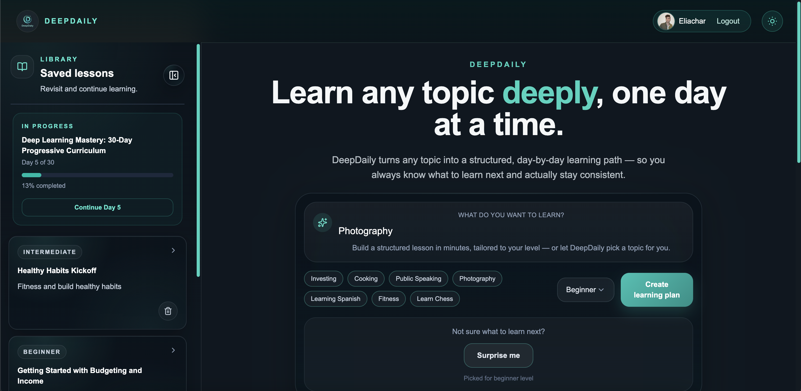
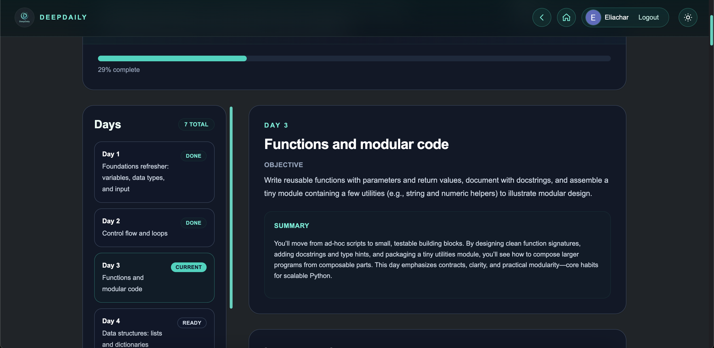
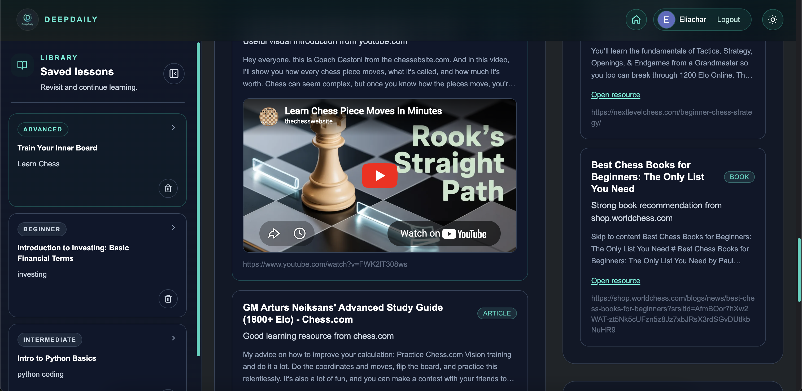

# 🧠 DeepDaily

> Learn anything deeply — one day at a time.

🌐 **Live App:** https://deepdaily.net/

DeepDaily is an AI-powered learning platform that generates structured, day-by-day learning experiences for any topic. It is powered by a system of custom-built AI agents developed from scratch, combining LLM-driven lesson generation, intelligent resource discovery, and personalized curricula into a seamless learning journey.

---

## 🎥 Demo

👉 Click to watch the full demo

---

## 📸 Product Preview

### 🏠 Generate a Learning Path

Turn any topic into a structured learning journey in seconds.

---

### 📅 Structured Daily Curriculum

Follow a clear, day-by-day roadmap with progress tracking and guided lessons.

---

### 🔍 Curated Resources & Embedded Content

Access high-quality resources, including articles, books, and embedded videos — all tailored to your learning path.

---

## ✨ Features

- 📚 **AI-Generated Lessons**
  - Structured lessons generated in real-time using LLMs
  - Clear explanations, examples, and exercises

- 🗺️ **Daily Curriculum System**
  - Multi-day learning paths
  - Progressive difficulty and topic breakdown
  - Resume where you left off

- 🎯 **Level-Adaptive Learning**
  - Choose your level: Beginner / Intermediate / Advanced
  - Content dynamically adapts in depth and complexity

- 🔍 **Smart Resource Discovery**
  - Automatically curated learning resources per day
  - Domain scoring system (docs > tutorials > noise)
  - High-quality links (React docs, Python docs, etc.)

- 🌐 **Real Web Search Integration**
  - Uses live web search to enrich learning content
  - Avoids hallucinated or outdated resources

- 💾 **Save & Update Lessons**
  - Save generated lessons to your account
  - Update existing lessons seamlessly

- 🔐 **Authentication**
  - Firebase Authentication
  - Secure user-based data storage

- ⚡ **Streaming Experience**
  - Real-time lesson generation (SSE)
  - Smooth UX while content is being created

- 🎯 **Modern UI**
  - Built with TailwindCSS
  - Dark mode support
  - Fully responsive (mobile-first)

---

## 🤖 Agent Architecture

DeepDaily is powered by a system of **custom-built AI agents developed from scratch**, each responsible for a specific part of the learning pipeline. :contentReference[oaicite:0]{index=0}  

These agents collaborate to transform a user-defined topic into a structured, level-adapted, multi-day learning experience.

---

### 🧠 Planner Agent

Designs the overall learning journey based on the **topic and user level**.

**Responsibilities:**
- Breaks down a topic into a structured multi-day curriculum
- Adapts roadmap complexity based on user level (beginner / intermediate / advanced)
- Defines daily learning objectives
- Ensures logical progression and concept coverage

---

### 📘 Lesson Generation Agent

Generates the core learning content for each day.

**Responsibilities:**
- Creates clear, structured explanations for the given topic
- Adapts depth and complexity to the user’s level
- Adds examples, analogies, and practical context
- Builds deep-dive sections for advanced understanding

---

### 🔍 Resource Discovery Agent

Enriches lessons with high-quality external knowledge using **real web search**.

**Responsibilities:**
- Performs web search to find relevant learning materials
- Scores sources using a custom domain-ranking system  
- Filters out noisy or low-value sources
- Selects the most relevant resources based on topic and difficulty level

---

### 📅 Daily Curriculum Agent

Assembles each individual learning day into a cohesive experience.

**Responsibilities:**
- Combines:
  - Learning objectives
  - Lesson content
  - Resources
- Ensures consistency across all days
- Aligns content with topic scope and user level

---

### ✅ Evaluation & Refinement Agent

Ensures quality, clarity, and coherence across all generated content.

**Responsibilities:**
- Reviews outputs for clarity and completeness
- Detects gaps, inconsistencies, or redundancy
- Refines content when needed

---

## 🔄 How It Works

1. User inputs a **topic** and selects a **difficulty level**  
2. Planner Agent generates a structured multi-day roadmap  
3. For each day:
   - Lesson Agent generates content (streamed)
   - Resource Agent fetches real-world resources
   - Daily Agent assembles the final lesson
4. Evaluation Agent refines the output  
5. Content is delivered in real-time to the user  

---

## 🚀 Why DeepDaily is Different

Unlike typical AI tools that generate one-off answers, DeepDaily:

- 🧠 Builds **structured learning journeys**, not just responses  
- 🔄 Uses a **multi-agent system**, not a single prompt  
- 🌐 Integrates **real web knowledge**, not just model memory  
- 🎯 Adapts to **user level dynamically**  
- 📅 Encourages **daily consistency → long-term mastery**

> This is closer to an AI-powered “learning system” than a chatbot.

---

## 🏗️ Tech Stack

### Frontend
- Next.js 16+ (App Router)
- React 19
- TypeScript
- TailwindCSS
- Sonner

### Backend
- FastAPI
- Python 3.11+
- Async architecture
- SQLAlchemy (async)
- PostgreSQL / SQLite (dev)

### AI Layer
- Multi-LLM support (OpenAI, etc.)
- Structured JSON outputs
- Streaming responses (SSE)

### Infrastructure
- Vercel (Frontend)
- Render (Backend)
- Firebase Auth
- Docker

---

## 🌍 Deployment

- **Frontend:** Vercel  
- **Backend:** Render  
- **Live URL:** https://deepdaily.net/  

---

## 📁 Project Structure

    deepdaily/
    │
    ├── apps/
    │   ├── web/                # Next.js frontend
    │   │   ├── app/
    │   │   ├── components/
    │   │   ├── lib/
    │   │   └── types/
    │   │
    │   └── api/                # FastAPI backend
    │       ├── app/
    │       │   ├── services/
    │       │   │   ├── agents/
    │       │   │   ├── curriculum_service.py
    │       │   │   └── ...
    │       │   ├── routers/
    │       │   ├── models/
    │       │   └── schemas/
    │       └── main.py

---

## 🚀 Getting Started

### Backend

    cd apps/api
    python -m venv .venv
    source .venv/bin/activate
    pip install -r requirements.txt
    python -m uvicorn app.main:app --reload

---

### Frontend

    cd apps/web
    npm install
    npm run dev

---

## 🔑 Environment Variables

### Backend

    OPENAI_API_KEY=your_key
    DATABASE_URL=your_db_url

### Frontend

    NEXT_PUBLIC_API_URL=http://localhost:8000
    NEXT_PUBLIC_FIREBASE_API_KEY=...
    NEXT_PUBLIC_FIREBASE_AUTH_DOMAIN=...

---

## 🔄 API Overview

### Lessons

    POST /lessons
    GET /lessons
    GET /lessons/{id}

### Curricula

    POST /curricula
    POST /curricula/{id}/generate-day
    POST /curricula/{id}/complete-day

---

## 💡 Future Improvements

- [ ] Spaced repetition system  
- [ ] Daily push notifications  
- [ ] Mobile app (Flutter)  
- [ ] Social learning  
- [ ] Offline mode  
- [ ] AI tutor memory  

---

## 🧑‍💻 Author

Eliachar Feig

- https://www.eliacharfeig.com/
- https://www.linkedin.com/in/eliachar-feig/
- https://github.com/eliacharfe

---

## ⭐ Contributing

Pull requests are welcome!

---

## 📄 License

MIT License

---

## ❤️ Philosophy

> Consistent, structured daily learning compounds into mastery.
